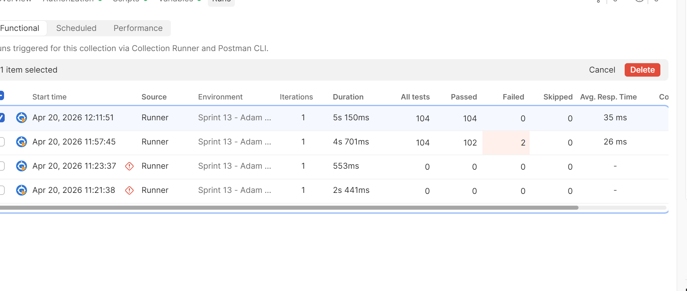

# WTWR (What to Wear?): Back End
The back-end project is focused on creating a server for the WTWR application. You’ll gain a deeper understanding of how to work with databases, set up security and testing, and deploy web applications on a remote machine. The eventual goal is to create a server with an API and user authorization.

Backend link se_project_fullstack: https://github.com/bluestem16173/se_project_fullstack/tree/main/backend

## Running the Project
`npm run start` — to launch the server 

`npm run dev` — to launch the server with the hot reload feature

### Testing
Before committing your code, make sure you edit the file `sprint.txt` in the root folder. The file `sprint.txt` should contain the number of the sprint you're currently working on. For ex. 12

## Postman Tests

The Postman collection was run locally using the Sprint 13 Tests collection.

All tests are passing (104/104).

Workspace link:
https://bluestem16173-9684928.postman.co/...

Note: The link may require login to view.

## Environment

base_url = http://localhost:3001

## How to run

1. Start server:
   npm install
   npm run dev

2. Open Postman
3. Use Sprint 13 Tests collection
4. Run collection  

 ## Project Pitch Video
https://www.loom.com/share/7ce4b0d22b554d2ba3c1e3fae6790f1e
https://drive.google.com/file/d/1-OXw-csGzcdl6SgXn4AEjb38zmjoX0ni/view?usp=sharing

# Weather App 🌤️

A full stack weather application that delivers real-time weather data 
through a dynamic single-page experience.

## Tech Stack

**Frontend:** React, SPA (Single Page Application)  
**Backend:** Node.js, Express  
**Database:** MongoDB  

## Features

- 🌍 Real-time weather data lookup by location
- ⚡ Dynamic single-page application — no page reloads
- 🗄️ MongoDB backend for storing search history or user data
- 🔌 RESTful API connecting frontend to backend seamlessly

## Project Structure

\`\`\`
weather-app/
├── frontend/   # React SPA
├── backend/    # Express REST API
└── vercel.json # Deployment config
\`\`\`

## Getting Started

\`\`\`bash
npm run install:all   # Install all dependencies
npm run dev           # Run frontend & backend together
\`\`\`